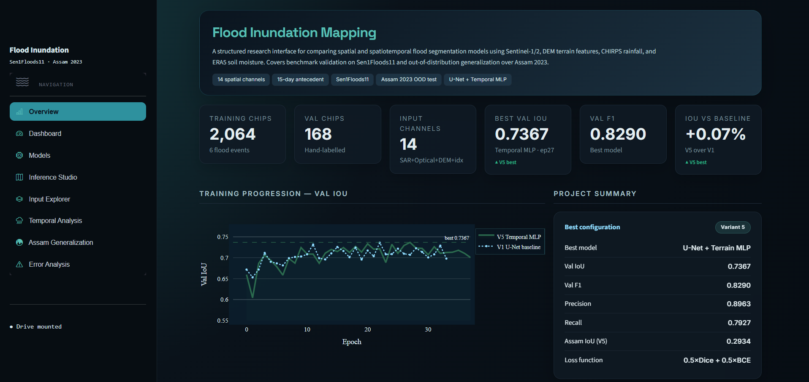

# Flood Inundation Mapping Using SAR, Optical, Terrain and Temporal Data

This repository contains the complete implementation of a flood inundation mapping system using multi-source satellite data and deep learning. The project combines Sentinel-1 SAR, Sentinel-2 optical bands, DEM-derived terrain features, CHIRPS rainfall, and ERA5 soil moisture data to detect flood extent.

The system was developed as part of a research implementation project focused on flood mapping using spatial and spatiotemporal deep learning models.

---

## Frontend Dashboard Preview
The project includes an interactive Streamlit dashboard for visualizing model results, input channels, prediction outputs, Assam 2023 generalization results, and error analysis.


---

## Project Objective

The main goal of this project is to build and compare flood segmentation models that can identify inundated regions from satellite imagery.

The project focuses on:

- Flood mapping using Sentinel-1 SAR and Sentinel-2 optical imagery.
- Adding terrain features such as Elevation, Slope, TWI, and HAND.
- Including 15-day antecedent rainfall and soil moisture information.
- Comparing spatial-only and spatiotemporal model variants.
- Testing model generalization on Assam 2023 flood data.
- Building an interactive frontend dashboard for visualization and analysis.

---

## Dataset

### 1. Sen1Floods11 Dataset

The main benchmark dataset used in this project is **Sen1Floods11 v1.1**.

Sen1Floods11 is a global flood detection dataset containing Sentinel-1 SAR imagery, Sentinel-2 optical imagery, and flood labels.

Dataset source:

```text
Google Cloud Bucket:
gs://sen1floods11/v1.1/

Countries used:
- India
- Pakistan
- Sri Lanka
- Cambodia (Mekong)
- Bolivia
- Colombia

---

## Input Data

- Sentinel-1 (VV, VH)
- Sentinel-2 (B2, B3, B4, B8, B11, B12)
- DEM: Elevation, Slope, TWI, HAND
- Temporal: CHIRPS, ERA5 (15 days)

---

## Model Variants

### V1 - U-Net Spatial only 
This is the baseline model.
14 spatial channels input


### V2 - U-Net + ConvLSTM
This model combines spatial and temporal information.
- Spatial branch : U-Net encoder-decoder
- Temporal branch : ConvLSTM over 15-day CHIRPS and ERA5 sequence
- Fusion: Late fusion at U-Net bottleneck


### V5 - U-Net + Terrain-Conditioned Temporal MLP
This is the best-performing model in the current implementation.
- Spatial U-Net branch
- 15-day temporal rainfall and soil moisture features
- Terrain-conditioned fusion using HAND

---

## Pipeline

1. Download dataset
1. Download Sen1Floods11 raw data
2. Export DEM derivatives from Google Earth Engine
3. Export CHIRPS and ERA5 temporal sequences from Google Earth Engine
4. Preprocess and stack all spatial channels
5. Compute normalization statistics
6. Train U-Net spatial baseline
7. Train temporal model variants
8. Compare ablation results
9. Run Assam 2023 generalization test
10. Visualize outputs in Streamlit dashboard

---

## Folder Structure
Flood_Inundation_Mapping/
│
├── README.md
├── .gitignore
│
├── notebooks/
│   ├── 01_download_sen1floods11.ipynb
│   ├── 02_gee_export_dem.ipynb
│   ├── 03_gee_export_temporal.ipynb
│   ├── 04_preprocessing.ipynb
│   ├── 05_train_unet_spatial.ipynb
│   ├── 06_train_convlstm.ipynb
│
├── dashboard/
│   └── app.py
│
├── assets/
│   ├── frontend_landing_page.png
│   ├── architecture.png
│
├── results/
│   ├── metrics/
│   ├── plots/
│   └── maps/
---

## System Requirements

- RAM: 16GB+
- GPU: T4/P100 recommended
- Storage: 100GB
- Platform: Kaggle GPU or Google Colab GPU

---

## Metrics

- IoU
- F1
- Precision
- Recall

---

## Results

### Validation
V1 IoU: 0.7360  
V5 IoU: 0.7367  

### Assam 2023
V1 IoU: 0.3049  
V5 IoU: 0.2934  

---

## Contributors

- Kusum B S
- N Nishita

---

## License

MIT
